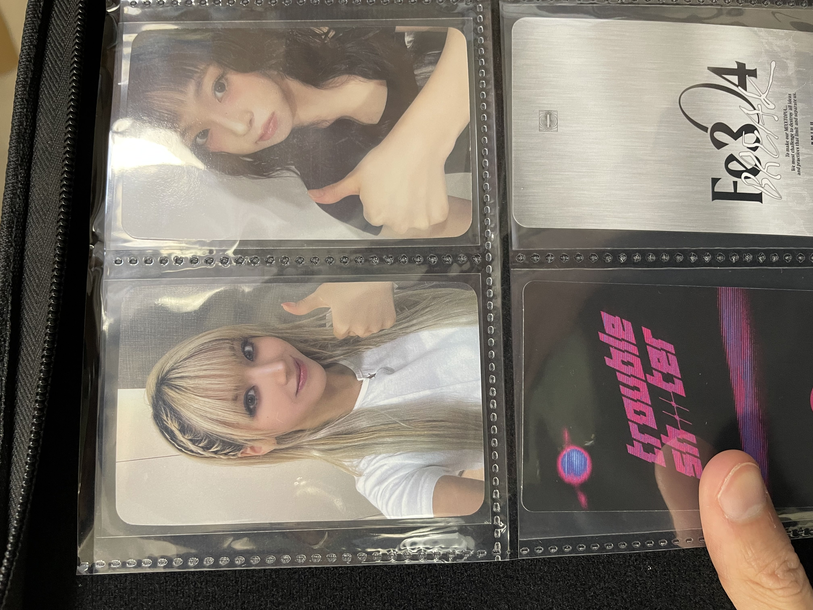

# ZOOM ZOOM ZOOM
No, I did not forget. I've just been busy of course!

## September 30
So, that was my birthday! Weirdest one I've had... I got sick. Not bad sickness just your regular sneezing and running nose, but it took like a week to resolve :/. Could have been worse so no complaints. It was a Monday and I spent the day working and recovering from sickness. Normal I guess, except I didn't celebrate, and not even on my own. Mainly because I was sick and didn't want to force myself. Ordered a pizza from Dominos, which costed like $11 with discounts (without discounts it would have been $35 for the smallest pizza 'Medium' I've ever seen). Dinner was just ramen; no cake, no sweets just ramen.

After that Monday I spent the rest of the week just recovering from sickness. My team was very okay with it and told me to focus on recovery; so I just left my work laptop on for notifications, and did work here and there for smaller, spread out intervals. Good stuff.

Saturday was cool, my sickness was mostly resolved but not fully. I'd decided that I wanted to spend the day going around Akiba and buying stuff for myself. Thankfully my friends sent me some cash so I used most of it to cover some nice items I'd be eyeing on! Rem & ram childhood version nendoroids (set), Kana Arima nendoroid, and a Yukihana Lamy nendoroid! From my own pocket I bought two Haewon photocards, two ichiban kuji plays for the Genshin event. And throughout the week before (so September 30-October 4) I also bought some manga, and an NMIXX album for myself.

Sunday was also cool! I went to Ikebukuro and picked up two booster boxes for Pokemon (crimson haze and the new paradise dragona), some cheap manga, a Karina photocard (gundam.), and lastly, one of the best, a $30~ Ram prize figure that I've literally been looking for since I've landed. The price was exactly what I expected and I knew that the first one I saw, I would be without a doubt. Worked out well it was my 'spend and focus on myself' weekend!

The booster box pulls were alright. Crimson haze I got an SR magcargo ($3~) and from dragona I got the SAR tera type alolan exeggutor which looks AMAZING ($30~). I'm still opening the paradise dragona box, one pack at a day! 

## October 15
Okay so today I went to the NMIXX pop up in Shibuya, Tokyo. Crazy cause I work in that city and I know it pretty well. Even crazier that they have a pop-up in Tokyo out of all places, considering I haven't seen a single advertisement with any member of NMIXX, let alone any good advertising in the music stores. Like for instance, Tower Records had KATSEYE advertised at the top of the escalator (you can't avoid it), while NMIXX got a tiny little end-of-aisle for their album debut.

Anyways, so if you spend 11000 yen ($110~ CAD) on goods (no albums) you get a CHANCE at winning from a few prizes (1 of 6 signed polaroids, 3 signed mini discs, 1 of 6 acylic keychains, polaroids, stickers) where the first 3 are limited to one person each 😵. I spent $65 cad on goods, so another 50 would have brought me to the threshold. Apparently the drawstring bag was delayed and I didn't even know! That would have brought me to the threshold since I would have bought the drawstring bag for sure. Sad :( I'll go back to get the drawstring and perhaps debate if spending $65 for a CHANCE at a polaroid is worth it 🤔.

Nonetheless, I should be happy that I even had the chance to attend, since it was purely luck really. Plus, I'm already very content with what I got! I guess that's why companies do these promotional things, to target victims like me into spending more 😭

## THAILAND
GOING TO THAILAND SOON!!! It's been SIX (6) years since I've gone and I'm super excited. Will be there with family from Canada (parents, aunt) and of course my Thai family. Honestly I've been there a lot so sightseeing isn't a main priority. As such, I'm just going to spend it eating Thai food, tropical fruits, Thai desserts, and hunting for kpop albums!

### Takeaways
Other than that, most of my days are spent the same. Some days I'll work then spend my evenings unwinding by watching Worlds 2024 or watching anime, while other days (namely weekends but some weekday evenings), I'll spend anywhere from 2 to 6 hours in a city window-shopping. I really like Ikebukuro since it was K-pop and Anime, and of course other shops like clothing places H&M, Uniqlo. But on evenings or days where I only want to spend a bit of time there, I'll go window shopping in Akihabara. I usually make sure to check out amiami figure tower for rare secondhand figures, Lashinbang, Trio DX (for photocards), and any trading card shops I walk by. Right now I'm trying to collect all of crimson haze JP! I just need the SRs and SARs now... which will run me easily $300 cad... thanks Greninja...

Take care, I'll try to write another entry while in Thailand! Nov3-16 :)
